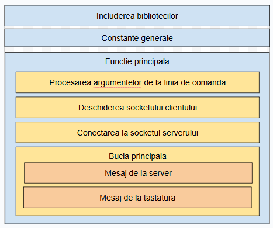

# Structura programului



# Includerea bibliotecilor

```c
#include <stdio.h>  // Bibliotecă pentru operații de intrare/ieșire
#include <unistd.h> // Bibliotecă pentru funcții POSIX (ex. close, read, write)
#include <stdlib.h> // Bibliotecă pentru funcții standard C (ex. malloc, exit)
#include <string.h> // Bibliotecă pentru manipularea șirurilor de caractere
#include <sys/types.h> // Tipuri de date pentru sistem (ex. pid_t, size_t)
#include <sys/socket.h> // Bibliotecă pentru operații cu socket-uri
#include <netinet/in.h> // Structuri pentru domeniul Internet (ex. sockaddr_in)
#include <netdb.h> // Funcții pentru lucrul cu numele de gazdă (ex. gethostbyname)

```
Aceste biblioteci sunt necesare pentru funcționalitatea programului:

- <stdio.h>: Funcții pentru intrare/ieșire (ex. printf, fgets).
- <unistd.h>: Funcții POSIX pentru manipularea descriptorilor de fișiere (ex. read, write, close).
- <stdlib.h>: Funcții generale pentru alocarea memoriei, conversii, ieșirea din program (ex. malloc, exit).
- <string.h>: Funcții pentru manipularea șirurilor de caractere (ex. strcpy, strcmp).
- <sys/types.h> și <sys/socket.h>: Structuri și funcții pentru lucrul cu socket-uri.
- <netinet/in.h> și <netdb.h>: Funcții și structuri pentru manipularea adreselor IP și comunicarea prin rețea.


# Constante globale

- MSG_SIZE: Dimensiunea maximă a unui mesaj trimis sau primit (90 de caractere).
- MAX_CLIENTS: Numărul maxim de clienți acceptați (95 în acest caz, dar utilizarea nu este prezentă în acest program).
- MYPORT: Portul implicit utilizat de aplicație, în cazul în care nu este specificat un port personalizat.

```c
#define MSG_SIZE 90        // Dimensiunea maximă a unui mesaj
#define MAX_CLIENTS 95     // Numărul maxim de clienți
#define MYPORT 7400        // Portul implicit al serverului
```


# Functia principala a programului (main)

```c
int main(int argc, char *argv[]) {
```

## Declaratii initiale

- port: Stochează portul utilizat pentru conectarea la server.
- fd: Descriptor de fișier utilizat în bucla select pentru a monitoriza activitatea.
- fd_set testfds și clientfds: Seturi de descriptori de fișiere folosiți pentru detectarea activității pe socket-uri și intrarea standard (stdin).
- msg: Buffer pentru mesajele primite de la server (maxim 90 de caractere plus caracterul \0).
- kb_msg: Buffer pentru mesajele tastate de utilizator (dimensiune redusă cu 10 caractere pentru prefixuri).


```c
   int port;                // Variabilă pentru port
   int fd;                  // Descriptor de fișier
   fd_set testfds, clientfds; // Seturi de descrieri pentru `select`
   char msg[MSG_SIZE + 1];     // Buffer pentru mesaje primite
   char kb_msg[MSG_SIZE - 10]; // Buffer pentru mesaje tastate de utilizator
```

## Initializarea variabilelor pentru client

- sockfd: Descriptor pentru socket-ul clientului.
- result: Variabilă pentru stocarea rezultatului operațiilor I/O (ex. read, write).
- hostname: Buffer pentru stocarea numelui gazdei serverului (ex. „localhost” sau o adresă IP).
- hostinfo: Structură utilizată pentru a obține informații despre gazdă (folosind gethostbyname).
- address: Structură care definește adresa serverului (ex. IP, port).

```c
   /* Variabile pentru client ========================*/
   int sockfd;             // Descriptor pentru socket-ul clientului
   int result;             // Rezultatul unei operații
   char hostname[MSG_SIZE]; // Numele gazdei serverului
   struct hostent *hostinfo; // Informații despre gazdă
   struct sockaddr_in address; // Structură pentru adresa serverului
```


## Procesarea argumentelor din linia de comanda

Verifică argumentele din linia de comandă:

 - Dacă se folosește opțiunea -p, portul și gazda sunt extrase din argumente.
 - Dacă -p lipsește, se folosește portul implicit MYPORT, iar numele gazdei este extras direct din argumente.

În caz de argumente invalide, afișează un mesaj de eroare și termină programul.
   
```c   
   if(argc==2 || argc==4){ // Verifică numărul de argumente
     if(!strcmp("-p",argv[1])){ // Verifică dacă primul argument este `-p`
       if(argc==2){ // Dacă numărul de argumente este invalid
         printf("Parametri invalizi.\nUtilizare: chat [-p PORT] HOSTNAME\n");
         exit(0); // Închide programul
       }else{ 
         sscanf(argv[2],"%i",&port); // Preia portul din argumente
         strcpy(hostname,argv[3]);  // Preia numele gazdei din argumente
       }
     }else{
       port=MYPORT; // Setează portul implicit
       strcpy(hostname,argv[1]); // Preia numele gazdei din argument
     }
     printf("\n*** Program client pornit (introdu \"quit\" pentru a ieși): \n");
     fflush(stdout); // Golește buffer-ul de ieșire
```

## Crearea si configurarea socketului, conectarea la server

Comunicarea intre doua programe aflate pe doua computere diferite si folosind TCP/IP ca protocol se face pe baza de socketuri. 

```c
     /* Creează un socket pentru client */
     sockfd = socket(AF_INET, SOCK_STREAM, 0);

     /* Configurează socket-ul cu adresa serverului */
     hostinfo = gethostbyname(hostname);  /* Obține informațiile despre gazdă */
     address.sin_addr = *(struct in_addr *)*hostinfo -> h_addr_list; // Adresa IP
     address.sin_family = AF_INET; // Domeniul de adrese: Internet
     address.sin_port = htons(port); // Setează portul (convertit în big-endian)

     /* Conectează socket-ul la server */
     if(connect(sockfd, (struct sockaddr *)&address, sizeof(address)) < 0){
       perror("conectare"); // Afișează eroarea
       exit(1); // Termină programul
     }
```


## Pregatirea pentru comunicare cu serverul 

```c
     fflush(stdout); // Golește buffer-ul de ieșire
     
     FD_ZERO(&clientfds); // Inițializează setul de descrieri
     FD_SET(sockfd,&clientfds); // Adaugă descriptorul socket-ului în set
     FD_SET(0,&clientfds); // Adaugă intrarea standard (tastatura) în set
```

## Bucla principala de comunicare

Se intra intr-0o bucla infinita care asteapta mesaje de la server si de la tastatura. Majoritatea timpului se petrece in 
instructiunea select care asteapta pana cand exista o oarecare activitate pe server. Odata ce se detecteaza ceva activitate pe server, se trece mai departe 
si se intra in for-ul care cicleaza prin toti file descriptorii cautand care este cel care a determinat select sa declanseze evenimentul.


```c
     /* Așteaptă mesaje de la server */
     while (1) { // Buclă infinită
       testfds=clientfds; // Copiază setul inițial
       select(FD_SETSIZE,&testfds,NULL,NULL,NULL); // Așteaptă activitate
       
       for(fd=0;fd<FD_SETSIZE;fd++){ // Parcurge toate descriptorii
          if(FD_ISSET(fd,&testfds)){ // Verifică dacă descriptorul este activ (ceea ce inseamna ca a primit ceva)
```

```c

Acest bloc prelucreaza mesajul care vine de la server (printeazas continutul la consola si in cazul in care mesajul incepe cu X inchide socketul)

             if(fd==sockfd){   /* Acceptă date de la server */
                
                result = read(sockfd, msg, MSG_SIZE); // Citește mesajul de la server
                 if (result == 0) {                        // Server closed
                    printf("\nServer disconnected.\n");    // afisam mesajul la consola
                    close(sockfd);                         // inchidem socketul
                    exit(0); // Exit the client program
                } else if (result == -1)  {
                    perror("read()"); 
                    close(sockfd);
                    exit(1);
                } else {
                    msg[result] = '\0';  /* Termină șirul cu null */
                    printf("%s", msg +1); // Afișează mesajul (excludând primul caracter)
                    
                    if (msg[0] == 'X') { // Dacă mesajul începe cu `X`
                        close(sockfd); // Închide socket-ul
                        exit(0); // Termină programul
                    }                             
                }
             }
```

Acest bloc proceseaza activitatea care vine de la tastatura. 


```c
             else if(fd == 0){ /* Procesează activitatea de la tastatură */
                
                fgets(kb_msg, MSG_SIZE+1, stdin); // Citește mesajul introdus de utilizator
                if (strcmp(kb_msg, "quit\n")==0) { // Dacă utilizatorul introduce `quit`
                    sprintf(msg, "XClient is shutting down.\n"); // Formatează mesajul de închidere
                    write(sockfd, msg, strlen(msg)); // Trimite mesajul către server
                    close(sockfd); // Închide socket-ul clientului
                    exit(0); // Termină programul
                }
                else {
                    sprintf(msg, "M%s", kb_msg); // Prefixează mesajul cu `M`
                    write(sockfd, msg, strlen(msg)); // Trimite mesajul către server
                }                                                 
             }          
          }
       }      
     }
```

Inchiderea buclelor

```c
   }// Sfârșitul codului pentru client
}//main

```